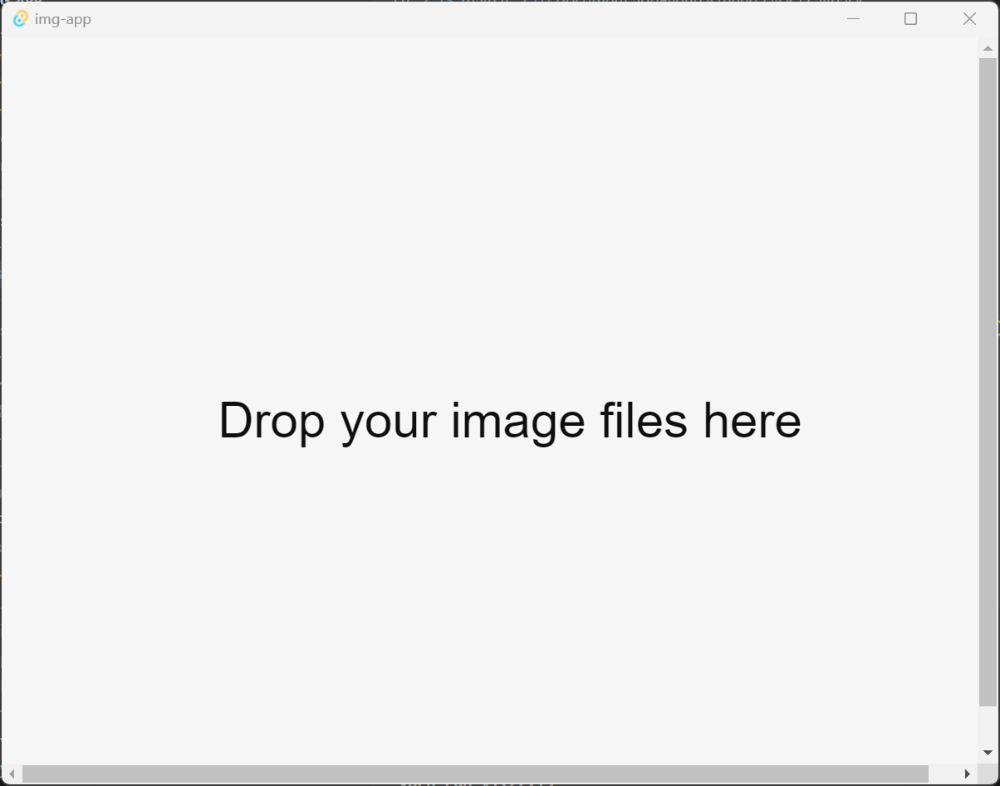

# 资源整理工具

> 学习rust的一些开源tauri的使用

# 小工具目前目标

使用[Tauri](https://tauri.app/) + Vanilla TS编写

展示文件目录下面（包括子目录）所有的图片，右键可以打开图片（或者双击打开图片），或者跳转到图片目录中去，也可以之间使用取色器去图片中的某个色块

# TODO

- [ ] 可以打tag
- [ ] 使用react + tailwindcss重写代码或者使用vue + tailwindcss重写
- [ ] 展示音频预览，可播放，跳转
- [ ] 展示spine动画
- [ ] 展示3d模型
- [ ] 引入webgpu
- [ ] 引入ffmpeg处理音视频的功能
- [ ] 以图搜图的功能
- [ ] 支持多平台使用，目前只支持Windows

# 小工具演示

